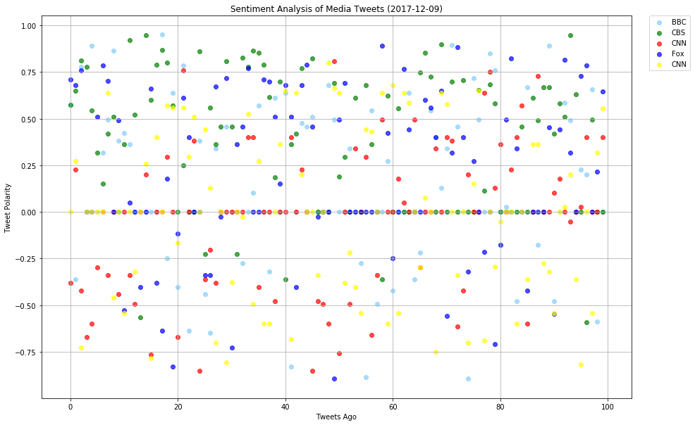
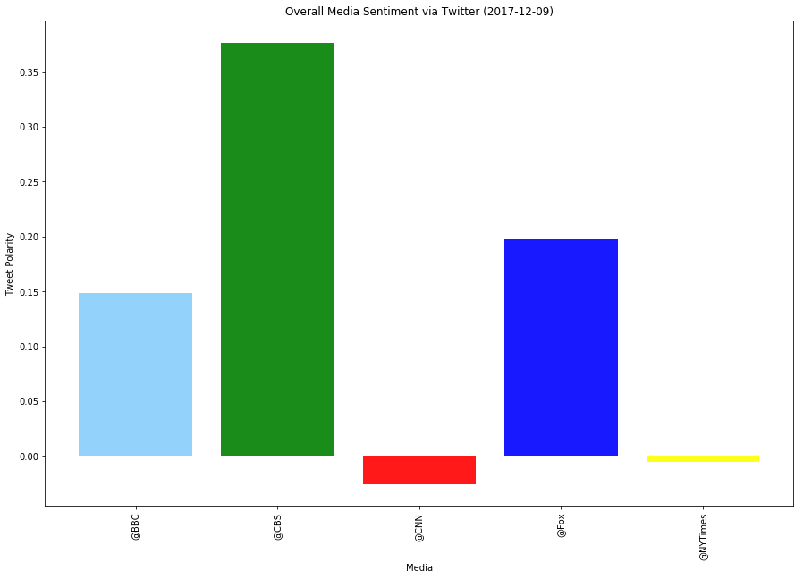

```python
# HW7 - Twitter 

# Dependencies

import time
import tweepy
import apikeys
import pandas as pd
import numpy as np
import matplotlib.pyplot as plt
import datetime
import seaborn
import csv
from vaderSentiment.vaderSentiment import SentimentIntensityAnalyzer
analyzer = SentimentIntensityAnalyzer()

```


```python
# Twitter API Keys
consumer_key = apikeys.TWITTER_CONSUMER_KEY
consumer_secret = apikeys.TWITTER_CONSUMER_SECRET
access_token = apikeys.TWITTER_ACCESS_TOKEN
access_token_secret = apikeys.TWITTER_ACCESS_TOKEN_SECRET

# Twitter credentials
auth = tweepy.OAuthHandler(consumer_key, consumer_secret)
auth.set_access_token(access_token, access_token_secret)
api = tweepy.API(auth, parser=tweepy.parsers.JSONParser())

```


```python
#Search through the different news names and collect Twitter data

# Target Search Term
news_terms = ["@BBC", "@CBS", "@CNN", "@Fox", "@NYTimes"]

compound_list = []
pos_list = []
neg_list = []
neutral_list = []
news_org = []
news_text = []
index = 0
count = []

for target in news_terms:
    
    index = 0
    
    public_tweets = api.user_timeline(screen_name=target, count=100)
    
    for tweet in public_tweets:
        
        text = tweet["text"]
        scores = analyzer.polarity_scores(text)
        compound = scores["compound"]
        pos = scores["pos"]
        neg = scores["neg"]
        neu = scores["neu"]
        news_name = target
            
        #Append the measure list
            
        compound_list.append(compound)
        pos_list.append(pos)
        neg_list.append(neg)
        neutral_list.append(neu)
        news_org.append(news_name)        
        news_text.append(text)
        count.append(index)
        index = index + 1


```


```python
#Enter collected data in a Data Frame

sentiment_news={"News Agency":'', "Compound Score":'', "Positive Score":'', "Negative Score":'', "Neutral Score":'',
               "Status Tweet":'', "Count":''}
sentiment_news["News Agency"] = news_org
sentiment_news["Compound Score"] = compound_list
sentiment_news["Positive Score"] = pos_list
sentiment_news['Negative Score'] = neg_list
sentiment_news['Neutral Score'] = neutral_list
sentiment_news['Status Tweet'] = news_text
sentiment_news['Count'] = count

sentiment_news_df = pd.DataFrame(sentiment_news)

# Rearrange the data columns

sentiment_news_df = sentiment_news_df[["Count","News Agency","Compound Score","Positive Score","Negative Score",
                                      "Neutral Score", "Status Tweet"]]
# Save the file to a csv file

sentiment_news_df.to_csv("MediaSentiments.csv")
sentiment_news_df.head()
```


<div>
<style>
    .dataframe thead tr:only-child th {
        text-align: right;
    }

    .dataframe thead th {
        text-align: left;
    }

    .dataframe tbody tr th {
        vertical-align: top;
    }
</style>
<table border="1" class="dataframe">
  <thead>
    <tr style="text-align: right;">
      <th></th>
      <th>Count</th>
      <th>News Agency</th>
      <th>Compound Score</th>
      <th>Positive Score</th>
      <th>Negative Score</th>
      <th>Neutral Score</th>
      <th>Status Tweet</th>
    </tr>
  </thead>
  <tbody>
    <tr>
      <th>0</th>
      <td>0</td>
      <td>@BBC</td>
      <td>0.5743</td>
      <td>0.179</td>
      <td>0.000</td>
      <td>0.821</td>
      <td>GET EXCITED!! 🎤❤️️🎶\n@Camila_Cabello has set t...</td>
    </tr>
    <tr>
      <th>1</th>
      <td>1</td>
      <td>@BBC</td>
      <td>-0.3595</td>
      <td>0.000</td>
      <td>0.135</td>
      <td>0.865</td>
      <td>Have we got five eight-year-olds robbing house...</td>
    </tr>
    <tr>
      <th>2</th>
      <td>2</td>
      <td>@BBC</td>
      <td>0.7783</td>
      <td>0.244</td>
      <td>0.000</td>
      <td>0.756</td>
      <td>The history of condoms stretches back around 3...</td>
    </tr>
    <tr>
      <th>3</th>
      <td>3</td>
      <td>@BBC</td>
      <td>0.0000</td>
      <td>0.000</td>
      <td>0.000</td>
      <td>1.000</td>
      <td>Sexually frivolous and morally ambiguous. \nMe...</td>
    </tr>
    <tr>
      <th>4</th>
      <td>4</td>
      <td>@BBC</td>
      <td>0.8911</td>
      <td>0.436</td>
      <td>0.096</td>
      <td>0.468</td>
      <td>RT @BBCWthrWatchers: Ok, so #snow can be a pai...</td>
    </tr>
  </tbody>
</table>
</div>


```python
# Overall Average Sentiments for each Media company.  Use this data for the Average Plots

sentiment_news_df.head()

avg_sentiment_df = sentiment_news_df.groupby("News Agency").mean()

avg_sentiment_df.head()
```


<div>
<style>
    .dataframe thead tr:only-child th {
        text-align: right;
    }

    .dataframe thead th {
        text-align: left;
    }

    .dataframe tbody tr th {
        vertical-align: top;
    }
</style>
<table border="1" class="dataframe">
  <thead>
    <tr style="text-align: right;">
      <th></th>
      <th>Count</th>
      <th>Compound Score</th>
      <th>Positive Score</th>
      <th>Negative Score</th>
      <th>Neutral Score</th>
    </tr>
    <tr>
      <th>News Agency</th>
      <th></th>
      <th></th>
      <th></th>
      <th></th>
      <th></th>
    </tr>
  </thead>
  <tbody>
    <tr>
      <th>@BBC</th>
      <td>49.5</td>
      <td>0.148951</td>
      <td>0.10069</td>
      <td>0.04565</td>
      <td>0.85364</td>
    </tr>
    <tr>
      <th>@CBS</th>
      <td>49.5</td>
      <td>0.376986</td>
      <td>0.16166</td>
      <td>0.01068</td>
      <td>0.82766</td>
    </tr>
    <tr>
      <th>@CNN</th>
      <td>49.5</td>
      <td>-0.025475</td>
      <td>0.05943</td>
      <td>0.06731</td>
      <td>0.87326</td>
    </tr>
    <tr>
      <th>@Fox</th>
      <td>49.5</td>
      <td>0.197157</td>
      <td>0.14422</td>
      <td>0.05133</td>
      <td>0.80444</td>
    </tr>
    <tr>
      <th>@NYTimes</th>
      <td>49.5</td>
      <td>-0.005266</td>
      <td>0.08443</td>
      <td>0.08213</td>
      <td>0.83343</td>
    </tr>
  </tbody>
</table>
</div>


```python
# Plot the scatter plot of Vader Sentiment Results

# Create new data frame per Media

bbc_df = sentiment_news_df.loc[sentiment_news_df["News Agency"] == '@BBC']
cnn_df = sentiment_news_df.loc[sentiment_news_df["News Agency"] == '@CNN']
cbs_df = sentiment_news_df.loc[sentiment_news_df["News Agency"] == '@CBS']
fox_df = sentiment_news_df.loc[sentiment_news_df["News Agency"] == '@Fox']
nyt_df = sentiment_news_df.loc[sentiment_news_df["News Agency"] == '@NYTimes']

# Obtain today's date

today_date = datetime.date.today()

# Plot a scatter plot per new dataframe

plt.figure(figsize=(15, 10))
plt.scatter(bbc_df['Count'], bbc_df['Compound Score'], marker='o', c='lightskyblue', alpha = 0.7, label = 'BBC')
plt.scatter(cbs_df['Count'], cbs_df['Compound Score'], marker='o', c='green', alpha = 0.7, label = 'CBS')
plt.scatter(cnn_df['Count'], cnn_df['Compound Score'], marker='o', c='red', alpha = 0.7, label = 'CNN')
plt.scatter(fox_df['Count'], fox_df['Compound Score'], marker='o', c='blue', alpha = 0.7, label = 'Fox')
plt.scatter(nyt_df['Count'], nyt_df['Compound Score'], marker='o', c='yellow', alpha = 0.7, label = 'CNN')
plt.legend(bbox_to_anchor=(1.03 , 1), loc=2, borderaxespad=0.)
plt.grid(True)
plt.title("Sentiment Analysis of Media Tweets "+"("+ str(today_date) + ")")
plt.xlabel("Tweets Ago")
plt.ylabel("Tweet Polarity")
plt.savefig("MediaTweetPolarityScatter.png")
plt.show()
```





```python
# Reset the index for avg sentiments for plotting

avg_sentiment_df = avg_sentiment_df.reset_index()
```


```python
# Plot average Vader sentiments

avg_sentiment_df.head()

# Chart our data, give it a title, and label the axes

plt.figure(figsize=(15, 10))

a, b, c, d, e = plt.bar(avg_sentiment_df['News Agency'], avg_sentiment_df['Compound Score'], alpha=0.9)
a.set_facecolor('lightskyblue')
b.set_facecolor('green')
c.set_facecolor('red')
d.set_facecolor('blue')
e.set_facecolor('yellow')

plt.xticks(avg_sentiment_df['News Agency'], rotation="vertical")

plt.title("Overall Media Sentiment via Twitter " + "(" + str(today_date) + ")")
plt.xlabel("Media")
plt.ylabel("Tweet Polarity")
plt.savefig("MediaTweetPolarityBar.png")
plt.show()
```




